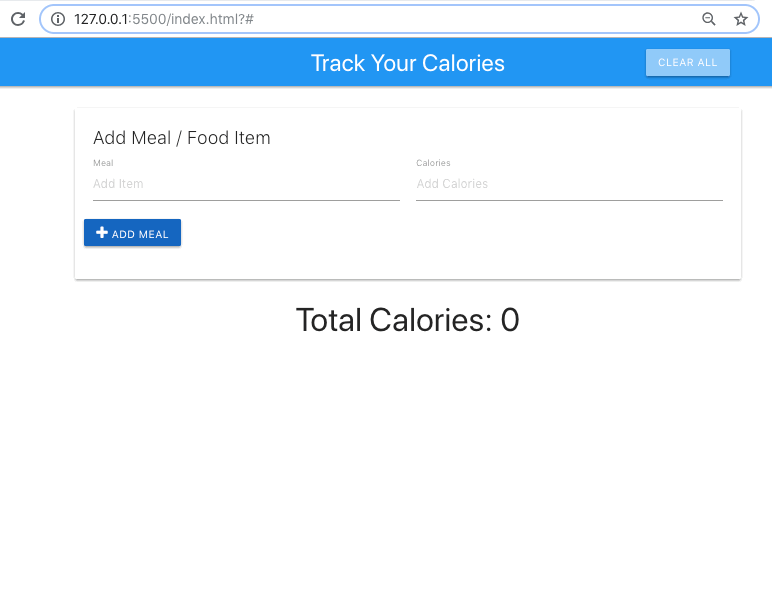
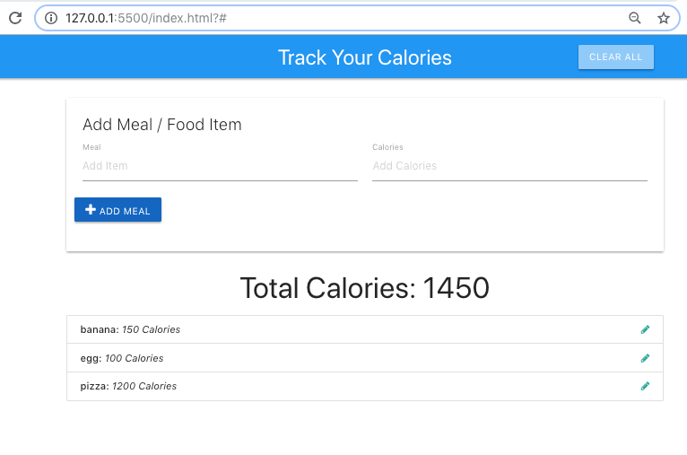

# Track Your Calories application

A website where you can add a meal or food item and set the number of calories. There is functionality to add, update and delete items.

The added items persist to local storage.

It is built purely with vanilla JavaScript, so no framework, applying the module pattern.

Materializecss is used for styling.
[materializecss](https://materializecss.com/getting-started.html)

## Screenshots

Add items

Edit item

## Author
* Albert Stjärne (https://github.com/AlbertStjarne)